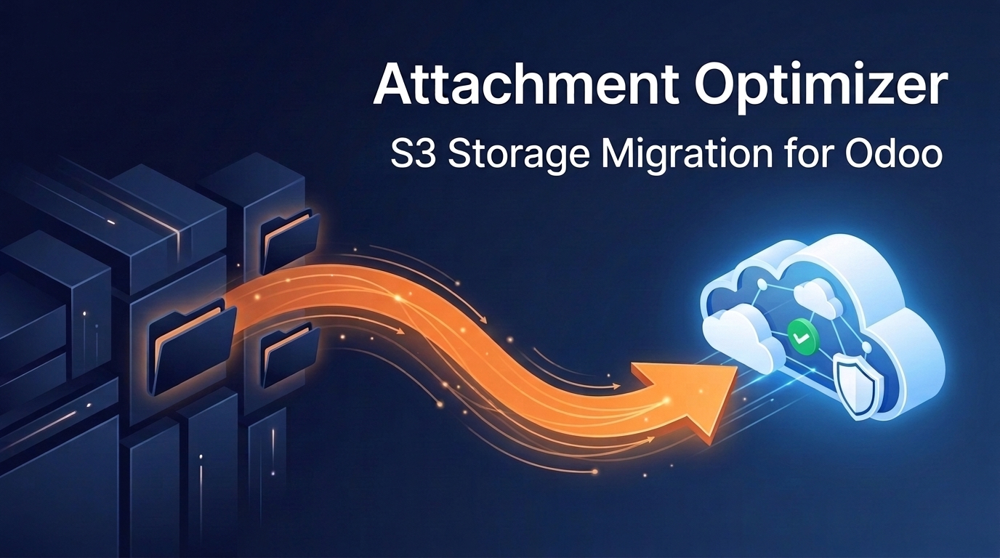
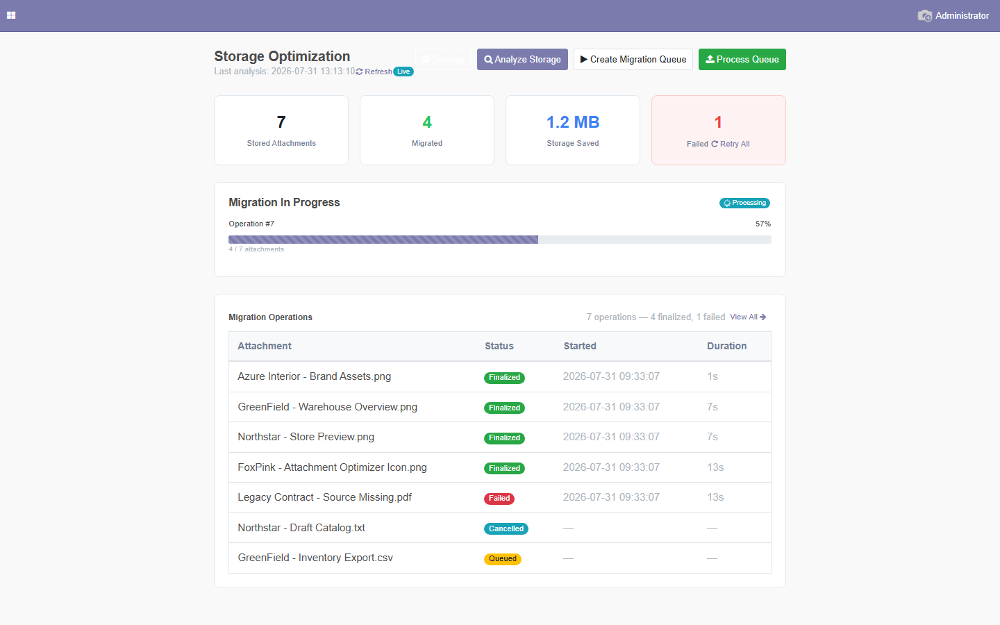
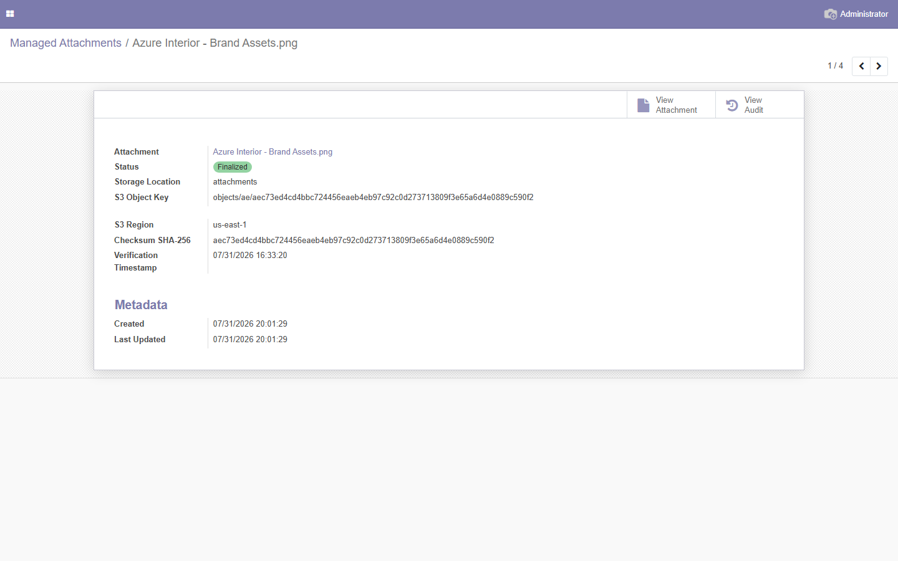
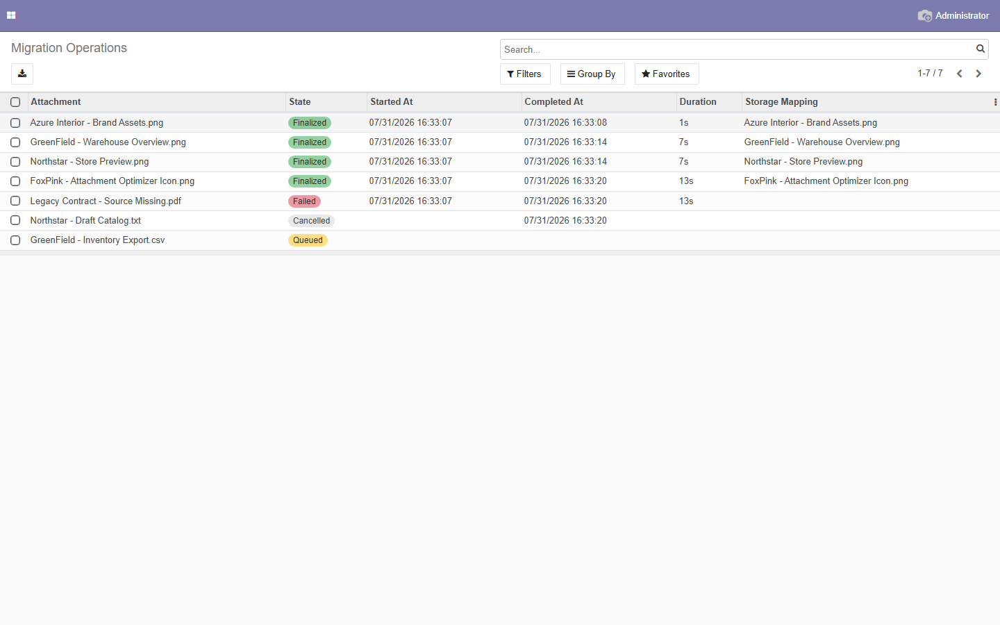
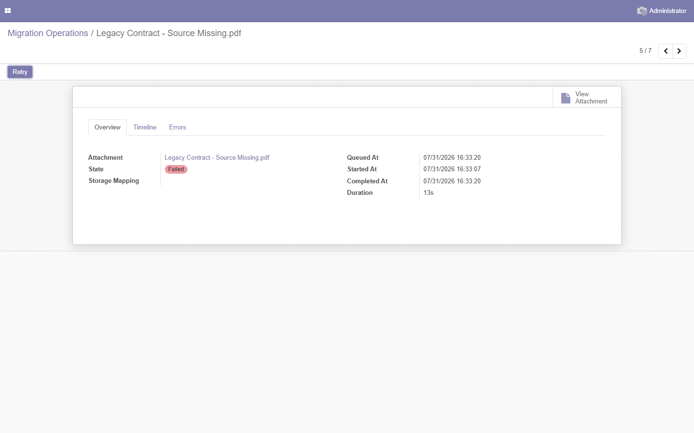
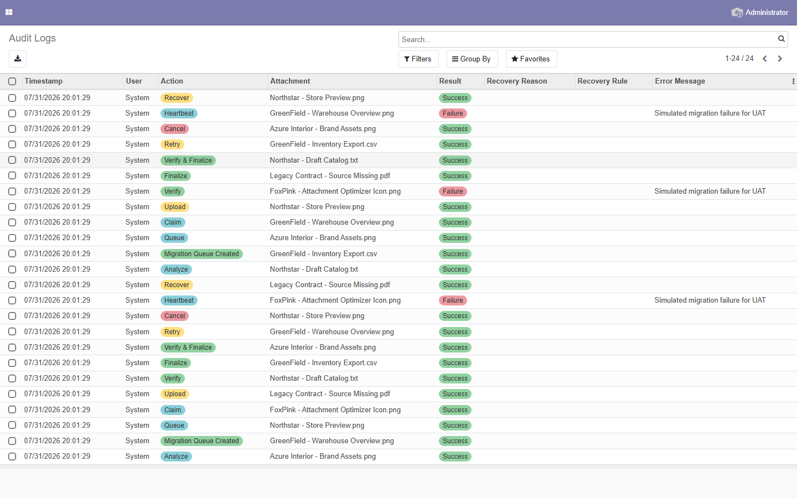
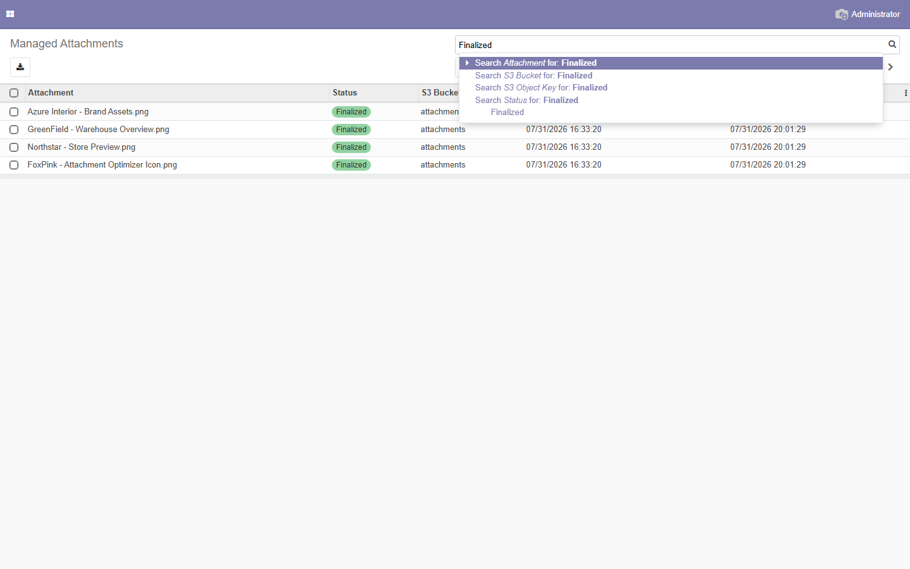
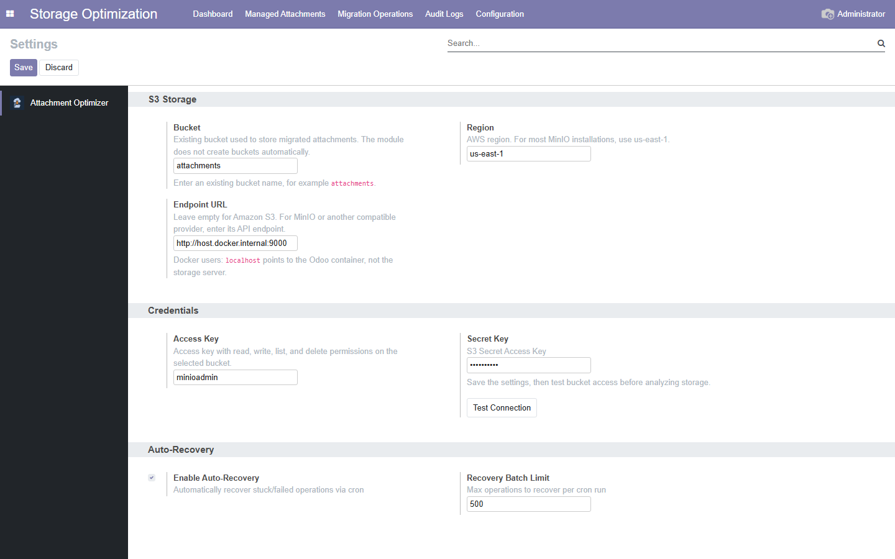
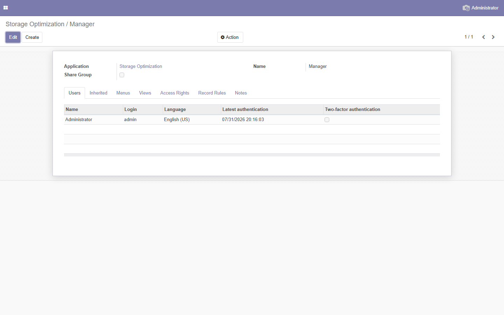

# Attachment Optimizer

> **Replicate and serve Odoo attachments from S3-compatible storage with rollback safety.**



**Version:** 14.0.1.0.1 — **License:** LGPL-3 — **Publisher:** FoxPink — **Validated release available for every Odoo series from 14.0 to 19.0.**

---

## Why use Attachment Optimizer?

Attachment Optimizer analyzes Odoo attachment storage and replicates selected binary attachments to S3-compatible object storage without changing existing business workflows. Each migration is verifiable, auditable, and reversible because the original filestore data is preserved.

| Problem | Solution |
|--------|----------|
| Need an external object copy | Replicate attachments to S3-compatible storage |
| Need verified object storage | Validate every uploaded object with SHA-256 |
| Need transparent access | Serve finalized mappings through Odoo with filestore fallback |
| Migration risk | SHA-256 verification |
| Rollback concern | Original filestore preserved |

- **Replicate attachments safely** — copy → verify → serve; original never deleted
- **Preserve access continuity** — attachments remain accessible during migration
- **Rollback anytime** — original filestore remains untouched

### Typical use cases

- ERP with millions of attachments
- Manufacturing systems storing PDFs
- Accounting databases with invoices
- Document-heavy Odoo deployments

> **Add verified S3-compatible attachment storage without changing business workflows.**

---

## How It Works

```
Analyze
    │
Queue
    │
Claim
    │
Upload
    │
Verify
    │
Finalize
     ▲
     │
Retry (idempotent)
```

---

## Architecture

```text
               Dashboard
                   │
        ┌──────────┴──────────┐
        │                     │
Migration Service      Health Engine
        │
   Queue Engine
        │
   Recovery Engine
        │
     S3 Bridge
        │
 Amazon S3 / MinIO / Compatible
```

---

## Features

### Storage
- **Analyze attachment usage** — find large, old, unused attachments
- **Detect migration candidates** — filter by size, age, model, access frequency
- **Track migrated volume** — measure attachments replicated to object storage

### Migration
- **Queue-based migration** — analyze → queue → claim → upload → verify → finalize
- **SHA-256 verification** — every file checksummed after upload
- **Retry failed uploads safely** — idempotent, no duplicates

### Safety
- **Original filestore preserved** — no data deleted during migration
- **Immutable audit logs** — every action logged with user, timestamp, result
- **Multi-company isolation** — record rules enforce data isolation

### Monitoring
- **Dashboard** — KPI cards (eligible, migrated volume, failed) with live progress
- **Health Checks** — 17 automated checks (DB, S3, queue, config, runtime)
- **Recovery Engine** — 5 rules auto-recover interrupted uploads

---

## Safety First

```
✓ Original filestore never deleted — retained for rollback safety
✓ Rollback always possible — original filestore remains untouched
✓ SHA-256 verification — integrity guaranteed on every file
✓ Immutable audit trail — every action logged with user, timestamp, result
✓ Retry is idempotent — retries never create duplicates
```

---

## Screenshots











---

## Installation

**Option 1 — Odoo Apps Store:** Download the ZIP for your Odoo version from the [Releases](https://github.com/FoxPinkHQ/attachment-optimizer/releases) page, unzip into your addons directory, restart Odoo, and install via Apps.

**Option 2 — Git:**

```bash
git clone -b 17.0 https://github.com/FoxPinkHQ/attachment-optimizer addons/attachment_optimizer
```

Before installing the module, install the required Python dependency in the same environment that runs Odoo:

```bash
pip3 install boto3
```

For Docker deployments, add `boto3` to the Odoo image instead of installing it manually inside a running container. After adding the module, restart Odoo, activate Developer Mode, go to **Apps → Update Apps List**, search for **Attachment Optimizer**, and install.

> **Deployment note:** This module requires Python code and the external `boto3` package. It is intended for Odoo.sh and on-premise/Docker deployments where server dependencies can be installed; it is not compatible with Odoo Online.

---

## Getting Started

1. **Configure S3** — Settings → Attachment Optimizer: endpoint, region, access key, secret key, bucket
2. **Test Connection** — verify S3 reachability
3. **Analyze Storage** — Dashboard → Analyze → find migration candidates
4. **Create Queue** — review candidates → Create Migration Queue
5. **Process Queue** — click Process Queue → monitor live progress
6. **Monitor Dashboard** — confirm migrated count, migrated volume, and failed count

---

## Configuration

1. **S3 Credentials:** Settings → Attachment Optimizer — enter endpoint URL, region, access key, secret key, bucket name
2. **Test Connection** — click "Test Connection" to verify S3 reachability
3. **Auto-Recovery:** optionally enable auto-recovery in the same settings section

> **Recommended:** Use the Settings page instead of editing System Parameters manually.

---

## Security

- **Role-based access** — Storage Optimization Manager group controls dashboard/settings
- **Multi-company isolation** — record rules enforce data isolation
- **Immutable audit log** — every action logged with user, timestamp, result
- **No credential is stored in audit logs**

---

## Current Limitations

- Single S3 bucket per installation
- No automatic filestore cleanup after finalization
- Migration queue is started manually
- Horizontal worker scaling is not currently supported

---

## Free Edition and Pro Roadmap

The Free Edition is designed to make the first step to S3 safe and useful. It includes storage analysis, manual migration queues, SHA-256 verification, transparent reads with filestore fallback, retry and recovery tools, dashboard monitoring, access control, and immutable audit logs. These core safety features are not trial-limited.

### Attachment Optimizer Pro — planned

The planned Pro Edition will focus on measurable storage savings and automation for larger Odoo environments:

- **Safe local cleanup** — reclaim filestore space only after successful checksum verification, with configurable retention and quarantine periods
- **Automatic storage routing** — send new attachments to S3 by model, MIME type, file size, company, and custom rules
- **One-click restore** — restore selected files or complete batches from S3 to the Odoo filestore before rollback or uninstall
- **Scheduled lifecycle policies** — migrate, archive, retain, restore, and clean up attachments automatically
- **Multi-bucket and multi-company routing** — isolate storage by company, environment, workload, or data policy
- **Background processing at scale** — scheduled batches, configurable concurrency, throttling, and resumable workers
- **Storage cost analytics** — compare local and object-storage volume, forecast growth, and report reclaimed space
- **Advanced security** — IAM role support, server-side encryption options, key rotation guidance, and policy validation
- **Provider-to-provider migration** — move verified objects between supported S3-compatible providers
- **Operational alerts and reports** — notify administrators about failed queues, storage health, policy violations, and recovery actions

> **Roadmap notice:** Pro features are planned and are not included in version 14.0.1.0.1. The Free Edition remains fully usable for safe, verified S3 replication and migration assessment.

---

## Technical Notes

- **Original filestore is preserved** — retained for rollback safety
- **Finalized attachments served from S3** via presigned URL stream
- **SHA-256 checksum verification** guarantees integrity on every file
- **Queue processing is idempotent** — retries never create duplicates
- **No monkey-patching of core Odoo models**
- **No modification of existing business workflows**

---

## Compatibility

Validated release available for every Odoo series from 14.0 to 19.0.  
Every supported Odoo version has its own dedicated branch and release package.

| Odoo Version | Status |
|---|---|
| 19.0 | [Branch 19.0](https://github.com/FoxPinkHQ/attachment-optimizer/tree/19.0) |
| 18.0 | [Branch 18.0](https://github.com/FoxPinkHQ/attachment-optimizer/tree/18.0) |
| 17.0 | [Branch 17.0](https://github.com/FoxPinkHQ/attachment-optimizer/tree/17.0) |
| 14.0 | ✅ This branch |
| 15.0 | [Branch 15.0](https://github.com/FoxPinkHQ/attachment-optimizer/tree/15.0) |
| 14.0 | [Branch 14.0](https://github.com/FoxPinkHQ/attachment-optimizer/tree/14.0) |

---

## Dependencies

- `base` (always)
- `web` (dashboard OWL components)
- **Python:** `boto3`

---

## Support

- **Issues:** [GitHub Issues](https://github.com/FoxPinkHQ/attachment-optimizer/issues)
- **Email:** aduy000@gmail.com

---

## License

**LGPL-3** — see [LICENSE](LICENSE).

