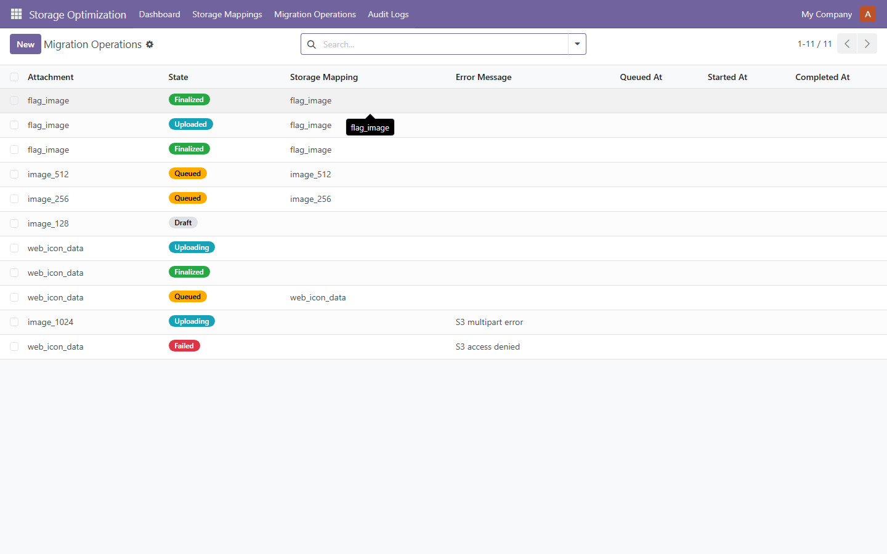

# Attachment Optimizer

> **Reduce Odoo filestore size by up to 95% while keeping full rollback safety.**


**Version:** 18.0.2.1.0 -- **License:** LGPL-3 -- **Publisher:** FoxPink -- Maintained for **Odoo 14.0-19.0** (one validated build per series)

## Why use Attachment Optimizer?

- **Reduce local storage usage** — move attachments to S3-compatible storage
- **Keep existing Odoo workflows unchanged** — transparent serving from S3
- **Migrate gradually with full visibility** — queue-based, visible progress
- **Retry failed uploads safely** — idempotent, no duplicates prevented duplicates prevented
- **Verify every migrated object** — SHA-256 checksum on every file
- **Preserve rollback capability** — original filestore never deleted

## Features

### Storage
- **Analyze attachment usage** — find large, old, unused attachments
- **Detect migration candidates** — filter by size, age, model, access frequency
- **Reduce filestore growth** — move cold data to S3, keep hot data local

### Migration
- **Queue-based migration** — analyze → queue → upload → verify → finalize
- **SHA-256 verification** — every file checksummed after upload
- **Retry failed uploads safely** — idempotent, duplicates prevented

### Safety
- **Original filestore preserved** — no data deleted during migration
- **Immutable audit logs** — every action logged with user, timestamp, result
- **Multi-company isolation** — record rules enforce company boundaries

### Monitoring
- **Dashboard** — KPI cards (total, migrated, saved bytes, failed) with live progress
- **Health Check** — 17 automated checks (DB, S3, queue, config, runtime)
- **Recovery Engine** — 5 rules auto-recover interrupted uploads

## Screenshots





## Installation

**Option 1 - Odoo Apps Store:** Download the ZIP for your Odoo version from the [Releases](https://github.com/FoxPinkHQ/attachment-optimizer/releases) page, unzip into your addons directory, restart Odoo, and install via Apps.

**Option 2 - Git:**

```bash
git clone -b 18.0 https://github.com/FoxPinkHQ/attachment-optimizer addons/attachment_optimizer
```

After adding the module, restart Odoo, activate Developer Mode, go to **Apps -> Update Apps List**, search for **Attachment Optimizer**, and install.

## Usage

1. **Configure S3** — Settings → Attachment Optimizer: endpoint, region, credentials, bucket
2. **Test Connection** — verify S3 reachability
3. **Analyze Storage** — Dashboard → Analyze → find migration candidates
4. **Create Queue** — review candidates, create migration queue
5. **Process Queue** — click Process Queue, monitor live progress
6. **Verify Dashboard** — confirm migrated count, saved bytes, failed count

## Configuration

1. **S3 Credentials:** Settings → Attachment Optimizer — enter endpoint URL, region, access key, secret key, bucket name
2. **Test Connection:** click "Test Connection" to verify S3 reachability
4. **Auto-Recovery:** optionally enable auto-recovery in the same settings section

> **Recommended:** Use the Settings page instead of editing System Parameters manually.

## Security

- **Original attachments remain in the Odoo filestore.** No data is deleted during migration.
- **Multi-company isolation** via record rules — users only see their company's data.
- **Role-based access** — Storage Optimization Manager group controls dashboard/settings access.

## Technical Notes

- **Original filestore is preserved** for rollback safety.
- **Finalized attachments are transparently served from S3** via presigned URLs.
- **SHA-256 checksum verification** guarantees integrity on every file.
- **Queue processing is idempotent** — retries never create duplicates.
- **Dual-write during transition** — both filestore and S3 have the file until finalized.

## Compatibility

| Odoo Version | Status |
|---|---|
| 19.0 | [Branch 19.0](https://github.com/FoxPinkHQ/attachment-optimizer/tree/19.0) |
| 18.0 | ✅ This branch |
| 17.0 | [Branch 17.0](https://github.com/FoxPinkHQ/attachment-optimizer/tree/17.0) |
| 16.0 | [Branch 16.0](https://github.com/FoxPinkHQ/attachment-optimizer/tree/16.0) |
| 15.0 | [Branch 15.0](https://github.com/FoxPinkHQ/attachment-optimizer/tree/15.0) |
| 14.0 | [Branch 14.0](https://github.com/FoxPinkHQ/attachment-optimizer/tree/14.0) |

Each series has its own git branch and validated release ZIP. Install the build matching your Odoo version.

## Dependencies

- `base` (always)
- `web` (dashboard OWL components)

## Support

- **Issues:** [GitHub Issues](https://github.com/FoxPinkHQ/attachment-optimizer/issues)
- **Email:** aduy000@gmail.com

## License

**LGPL-3** -- see [LICENSE](LICENSE).