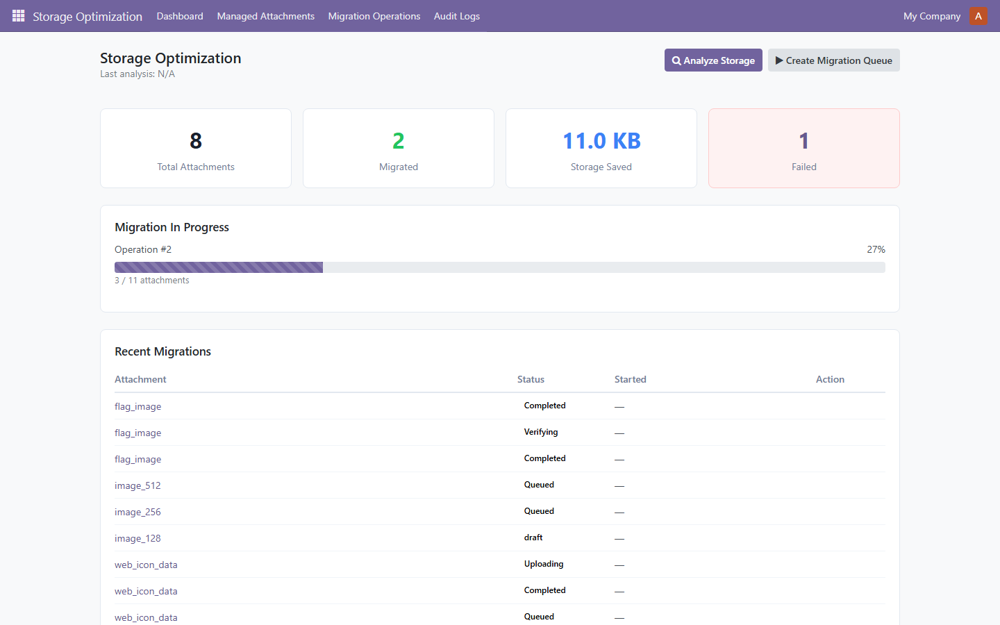
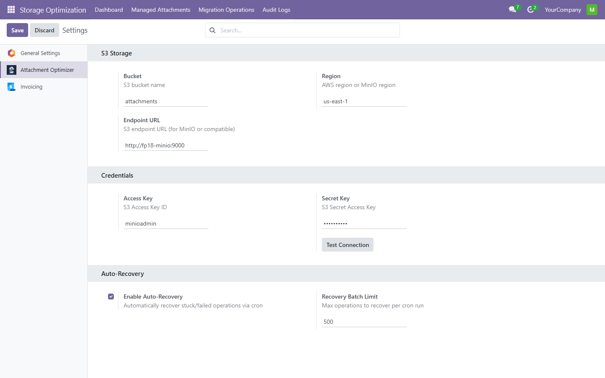
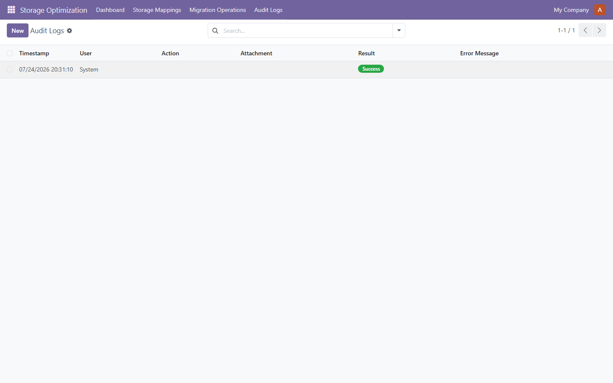

# Attachment Optimizer

> **Reduce Odoo filestore size by up to 95% while keeping full rollback safety.**


**Version:** 19.0.1.0.0 -- **License:** LGPL-3 -- **Publisher:** FoxPink -- **Validated release available for every Odoo series from 14.0 to 19.0.**

---

## Why use Attachment Optimizer?

Attachment Optimizer helps organizations keep Odoo storage under control by moving binary attachments to S3-compatible object storage without changing existing business workflows. The migration is verifiable, auditable, and fully reversible because original filestore data is preserved.

- **Reduce backup time** — from hours to minutes
- **Reduce infrastructure costs** — move cold attachments to low-cost object storage
- **Move attachments safely** — copy -> verify -> serve; original never deleted
- **Zero downtime** — attachments stay accessible during migration
- **Rollback anytime** — original filestore remains untouched

---

## How It Works

```
Analyze -> Queue -> Claim -> Upload -> Verify -> Finalize
                      ^_________↓
                      Retry (idempotent)
```

---

## Architecture

```
Dashboard
     |
Migration Service
     |
Queue Engine
     |
Recovery Engine
     |
S3 Bridge
     |
Amazon S3 / MinIO / Compatible
```

---

## Features

### Storage
- **Analyze attachment usage** — find large, old, unused attachments
- **Detect migration candidates** — filter by size, age, model, access frequency
- **Reduce filestore growth** — move cold data to S3, keep hot data local

### Migration
- **Queue-based migration** — analyze -> queue -> claim -> upload -> verify -> finalize
- **SHA-256 verification** — every file checksummed after upload
- **Retry failed uploads safely** — idempotent, no duplicates

### Safety
- **Original filestore preserved** — no data deleted during migration
- **Immutable audit logs** — every action logged with user, timestamp, result
- **Multi-company isolation** — record rules enforce data isolation

### Monitoring
- **Dashboard** — KPI cards (total, migrated, saved bytes, failed) with live progress
- **Health Checks** — 17 automated checks (DB, S3, queue, config, runtime)
- **Recovery Engine** — 5 rules auto-recover interrupted uploads

---

## Safety First

```
✓ Original filestore never deleted — dual-write for rollback safety
✓ Rollback always possible — original filestore remains untouched
✓ SHA-256 verification — integrity guaranteed on every file
✓ Immutable audit trail — every action logged with user, timestamp, result
✓ Retry is idempotent — retries never create duplicates
```

---

## Screenshots







---

## Installation

**Option 1 — Odoo Apps Store:** Download the ZIP for your Odoo version from the [Releases](https://github.com/FoxPinkHQ/attachment-optimizer/releases) page, unzip into your addons directory, restart Odoo, and install via Apps.

**Option 2 — Git:**

```bash
git clone -b 19.0 https://github.com/FoxPinkHQ/attachment-optimizer addons/attachment_optimizer
```

After adding the module, restart Odoo, activate Developer Mode, go to **Apps -> Update Apps List**, search for **Attachment Optimizer**, and install.

---

## Getting Started

1. **Configure S3** — Settings -> Attachment Optimizer: endpoint, region, access key, secret key, bucket
2. **Test Connection** — verify S3 reachability
3. **Analyze Storage** — Dashboard -> Analyze -> find migration candidates
4. **Create Queue** — review candidates -> Create Migration Queue
5. **Process Queue** — click Process Queue -> monitor live progress
6. **Monitor Dashboard** — confirm migrated count, saved bytes, failed count

---

## Configuration

1. **S3 Credentials:** Settings -> Attachment Optimizer: enter endpoint URL, region, access key, secret key, bucket name
2. **Test Connection** — click "Test Connection" to verify S3 reachability
3. **Auto-Recovery:** optionally enable auto-recovery in the same settings section

> **Recommended:** Use the Settings page instead of editing System Parameters manually.

---

## Security

- **Role-based access** — Storage Optimization Manager group controls dashboard/settings
- **Multi-company isolation** — record rules enforce data isolation
- **Immutable audit log** — every action logged with user, timestamp, result

---

## Current Limitations

- Single S3 bucket per installation
- No automatic filestore cleanup after finalization
- Migration queue is started manually
- Single worker per request (horizontal scaling planned)

---

## Technical Notes

- **Original filestore is preserved** — dual-write for rollback safety
- **Finalized attachments served from S3** via presigned URL stream
- **SHA-256 checksum verification** guarantees integrity on every file
- **Queue processing is idempotent** — retries never create duplicates

---

## Compatibility

Validated release available for every Odoo series from 14.0 to 19.0.  
Every supported Odoo version has its own dedicated branch and release package.

| Odoo Version | Status |
|---|---|
| 19.0 | [Branch 19.0](https://github.com/FoxPinkHQ/attachment-optimizer/tree/19.0) |
| 19.0 | ✅ This branch |
| 17.0 | [Branch 17.0](https://github.com/FoxPinkHQ/attachment-optimizer/tree/17.0) |
| 16.0 | [Branch 16.0](https://github.com/FoxPinkHQ/attachment-optimizer/tree/16.0) |
| 15.0 | [Branch 15.0](https://github.com/FoxPinkHQ/attachment-optimizer/tree/15.0) |
| 14.0 | [Branch 14.0](https://github.com/FoxPinkHQ/attachment-optimizer/tree/14.0) |

---

## Dependencies

- `base` (always)
- `web` (dashboard OWL components)

---

## Support

- **Issues:** [GitHub Issues](https://github.com/FoxPinkHQ/attachment-optimizer/issues)
- **Email:** aduy000@gmail.com

---

## License

**LGPL-3** — see [LICENSE](LICENSE).

