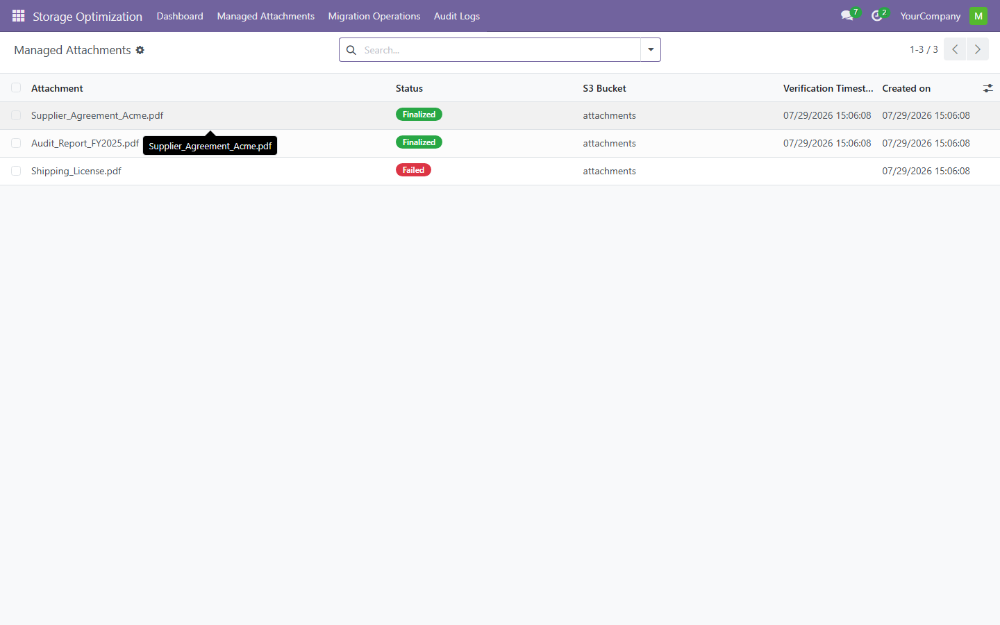
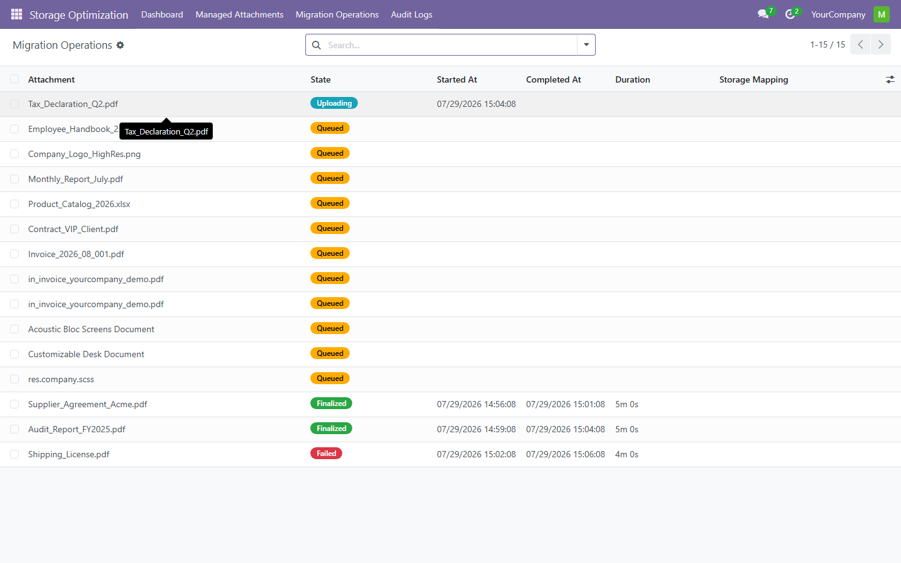
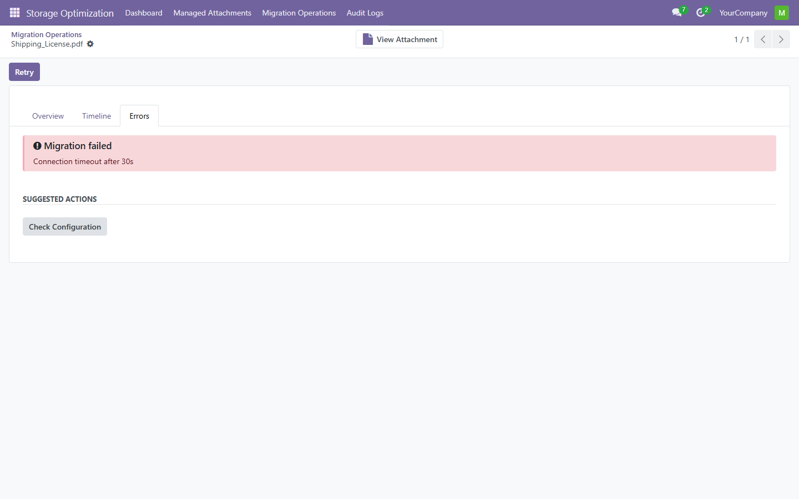
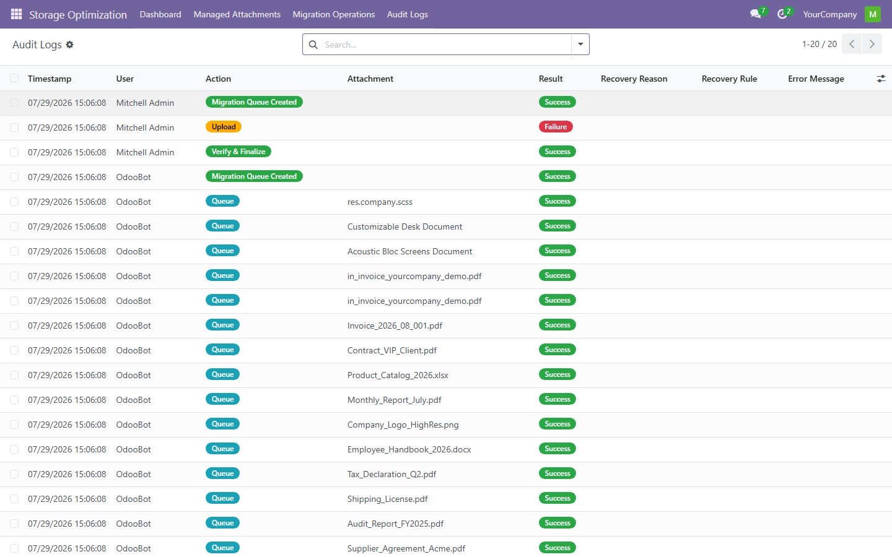

# Attachment Optimizer

> S3 storage migration and optimization for Odoo attachments — **Odoo 18.0** Community Edition.


**Version:** 18.0.2.1.0 -- **License:** LGPL-3 -- **Publisher:** FoxPink -- **Odoo 18.0** (one validated build per series)

## Features

- **Migration pipeline** -- analyze, queue, upload, verify and finalize attachment migration to S3-compatible storage
- **Checksum verification** -- SHA-256 read-after-write ensures data integrity before finalizing
- **Dashboard** -- KPI cards (total, migrated, saved bytes, failed) with live progress bar
- **S3 bridge** -- configurable endpoint, region and credentials; works with AWS S3, MinIO, any S3-compatible store
- **Audit trail** -- every migration action logged with user, timestamp and result
- **Retry and resume** -- failed uploads retried individually or in bulk; idempotent design prevents duplicates
- **Recovery engine** -- 5 repair rules (heartbeat timeout, stale workers, partial uploads, ownership conflicts)
- **Health engine** -- 17 automated checks across database, S3, queue, configuration and runtime

## Screenshots








## Installation

**Option 1 - Odoo Apps Store:** Download the ZIP for your Odoo version from the [Releases](https://github.com/FoxPinkHQ/attachment-optimizer/releases) page, unzip into your addons directory, restart Odoo, and install via Apps.

**Option 2 - Git:**

```bash
git clone -b 18.0 https://github.com/FoxPinkHQ/attachment-optimizer addons/attachment_optimizer
```

After adding the module, restart Odoo, activate Developer Mode, go to **Apps -> Update Apps List**, search for "Attachment Optimizer", and install.

## Configuration

1. **S3 Credentials:** Settings -> General Settings -> Attachment Optimizer -- enter endpoint URL, region, access key, secret key and bucket name
2. **Test Connection:** click "Test Connection" to verify S3 reachability
3. **Auto-Recovery:** optionally enable auto-recovery in the same settings section

## Dependencies

- `base` (always)
- `web` (dashboard OWL components)

## Compatibility

| Odoo Version | Status |
|---|---|
| 18.0 | ✅ This branch |

Each series has its own git branch and validated release ZIP. Install the build matching your Odoo version.

## Support

- **Issues:** [GitHub Issues](https://github.com/FoxPinkHQ/attachment-optimizer/issues)
- **Email:** aduy000@gmail.com

## License

**LGPL-3** -- see [LICENSE](LICENSE).
